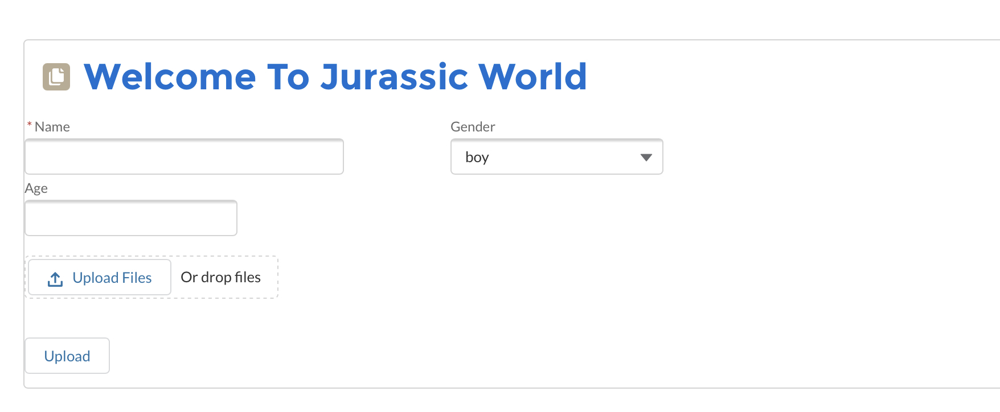

# This is SFDC code for My Mulesoft Hackathon 2020 commit

There is 3 main component of LWC which are attachmentFileUploader, resultDetail and FriendTile.
There is only one apex class called fileUpload for HTTP callout(May be we can also use Fetch method to do this on the client side).

"attachmentFileUploader" is maily for upload picture draw by child and have a child component "resultDetail" to show the result.


"resultDetail" component is also with a component "FriendTile" to display friendList.
For radar chart in the middle of the page, we use ChartJs.


The data of the resultDetail is from [our Mulesoft API](https://github.com/HninPwintP/mulesoftHackathon2020/tree/master/dinosaur-api2), where the reult is like below:
```
{"dinosaurs_info": {
    "uploadPhotoURL": "url",
    "samplePhotoURL": "url",
    "dinosaurName": "Pteranodon",
    "sampleDinosaurInfo": {
      "power": 43,
      "speed": 81,
      "attack": 4,
      "defence": 86,
      "Intelligence": 31
    },
    "power": 97,
    "speed": 5,
    "attack": 30,
    "defence": 11,
    "Intelligence": 19
  },
  "user_info": {
    "user_name": "Holiday",
    "age": "46",
    "gender": "boy",
    "location_Long": "137",
    "location_Lad": "34"
  },
  "friend_list": [
    {
      "user_name": "Jennifer",
      "age": "8",
      "gender": "girl",
      "location_Long": "136",
      "location_Lad": "36",
      "url": "url"
    },
    {
      "user_name": "KK",
      "age": "8",
      "gender": "girl",
      "location_Long": "138",
      "location_Lad": "33",
      "url": "url"
    }
  ]
}
```

For More Detail of this project, Please reference [here](https://dev.to/cutiejbiu/share-your-dinosaurs-4kk9)

